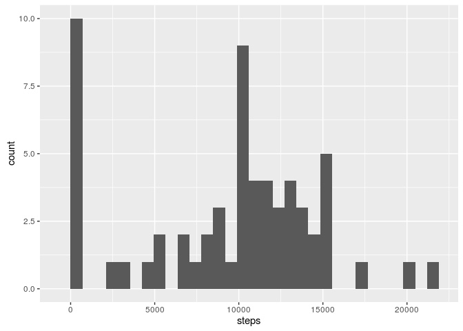
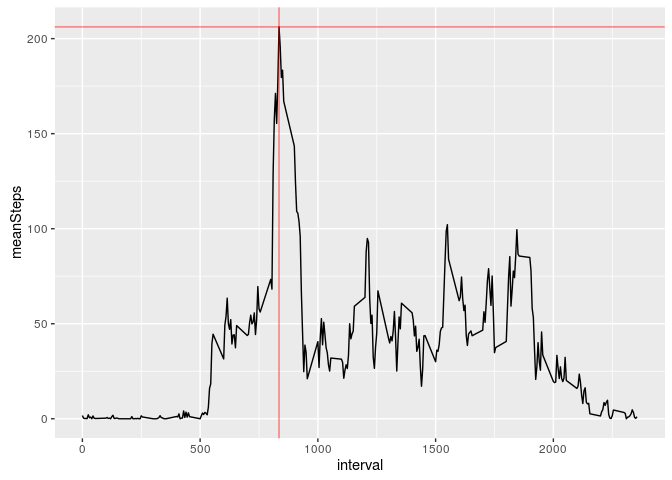
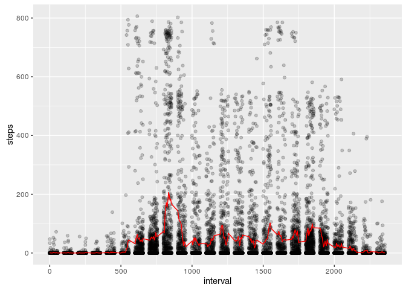
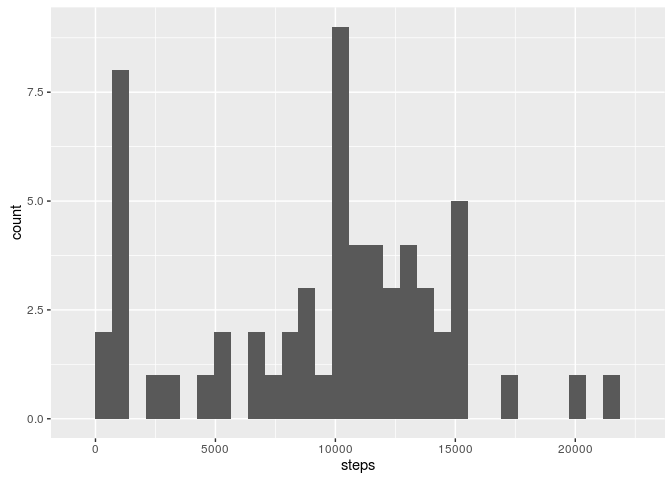
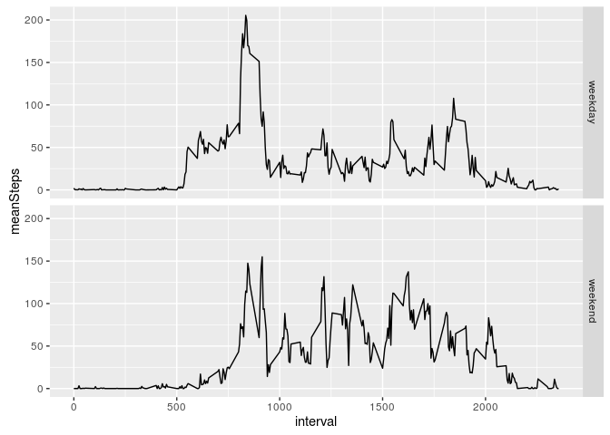

# Reproducible Research: Peer Assessment 1


## Loading and preprocessing the data

First, we unzip the data, load it into R, and parse dates.


```r
unzip("activity.zip") # Creates activity.csv
data <- read.csv("activity.csv")
data$date = as.POSIXct(data$date)
```

We also load some libraries we are going to need.


```r
library(dplyr)
library(ggplot2)
```


## What is the mean total number of steps taken per day?

First, we calculate the sum per day and plot a histogram of the values.
We also check the basic statistics for good measure.


```r
day_data <- data %>%
            group_by(date) %>%
            summarize(steps = sum(steps, na.rm=T))
            
qplot(steps, data = day_data)
```

```
## `stat_bin()` using `bins = 30`. Pick better value with `binwidth`.
```

<!-- -->

```r
summary(day_data$steps)
```

```
##    Min. 1st Qu.  Median    Mean 3rd Qu.    Max. 
##       0    6778   10400    9354   12810   21190
```


## What is the average daily activity pattern?

We want to looks at what an average day looks like. For that purpose, we
look at the average step counts of the individual intervals, averaged over
all days.


```r
interval_data <- data %>%
                 group_by(interval) %>%
                 summarize(meanSteps = mean(steps, na.rm=T))

max_interval <- interval_data$interval[which.max(interval_data$meanSteps)]
               
qplot(interval, meanSteps, data = interval_data, geom = "line") + 
  geom_vline(xintercept=max_interval, color="red", alpha=0.5) + 
  geom_hline(yintercept=max(interval_data$meanSteps), color="red", alpha=0.5)
```

<!-- -->

On average, the most steps (206 &#177; 1) happened in interval 835.


## Imputing missing values

First, let us check how many `NA`s there are.


```r
nrow(filter(data, is.na(steps)))
```

```
## [1] 2304
```

Let us get a feeling for the distribution of non-NA values:


```r
ggplot(na.omit(data), aes(interval, steps)) + 
  geom_point(alpha=0.2) + 
  stat_summary(aes(y=steps, group=1), fun.y=mean, colour="red", geom="line", group=1)
```

<!-- -->

We see that *most* values seem to be close to zero in all intervals, and in particular
below the mean; relatively few outliers move the means up.
So filling in interval means for missing values may skew averaging statistics
unduly; we therefore will fill in *median* values.


```r
interval_medians <- data %>%
                    group_by(interval) %>%
                    summarize(medianSteps = median(steps, na.rm=T))
                    
medians <- sapply(data$interval, function(x) { interval_medians[interval_medians$interval == x,]$medianSteps })

filled_data <- data.frame(data)
nas <- is.na(data$steps)
filled_data$steps[nas] = medians[nas]
```

Now we repeat the same day-wise analysis from above.


```r
day_data2 <- filled_data %>%
              group_by(date) %>%
              summarize(steps = sum(steps, na.rm=T))
            
qplot(steps, data = day_data2)
```

```
## `stat_bin()` using `bins = 30`. Pick better value with `binwidth`.
```

<!-- -->

```r
summary(day_data2$steps)
```

```
##    Min. 1st Qu.  Median    Mean 3rd Qu.    Max. 
##      41    6778   10400    9504   12810   21190
```

We note that imputing medians slightly increases the mean of the daily data
(by ca 150).
No quartiles but the minimum are affected, so we guess that the slight increase
in the mean is due to fewer (implicit) zeroes. Verifying this would need
further analysis.


## Are there differences in activity patterns between weekdays and weekends?

First, we have to distinguish observations according to whether they
happened on a week or weekend day.


```r
filled_data$weekday = as.factor(
  sapply(weekdays(filled_data$date), function(x) { 
    if ( x == "Samstag" | x == "Sonntag" ) { "weekend" } else { "weekday" } 
  })
)
```

Now we plot the daily profiles for weekdays and weekend separately.


```r
interval_data2 <- filled_data %>%
                  group_by(interval, weekday) %>%
                  summarize(meanSteps = mean(steps, na.rm=T))

ggplot(interval_data2, aes(interval, meanSteps)) +
  geom_line() +
  facet_grid(weekday ~ .)
```

<!-- -->

There seem to be differences: on weekdays is profile has more pronounced peaks.
Maybe on weekdays, the user went for a run in the morning and then moved little 
besides a few short breaks and on the way back home, and on the weekend they
do not do any exercise but move more during the day. More analysis needed.

---

Since we only want to keep the zip file, we remove the unzipped CSV.


```r
file.remove("activity.csv")
```
